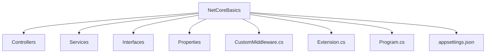

# 📘 NetCoreBasics

> Projeto de base com exemplos práticos das funcionalidades oferecidas pelo ASP.NET Core / .NET — ideal para iniciantes e para estruturar projetos mais maduros.


---

## 📖 Visão Geral

O projeto NetCoreBasics tem como propósito:

* Demonstrar, de forma simples e direta, os **fundamentos do ASP.NET Core e .NET 8**: configuração, middleware, injeção de dependência, logs, extensões.
* Servir como base ou *starter template* para novos projetos, com código limpo e organizada.
* Ajudar desenvolvedores que estão migrando para .NET 8 ou começando com Web API a ganhar confiança.

---

## 🧩 Estrutura do Projeto



**Destaques das pastas e arquivos:**

* `Controllers` → endpoints da Web API ou camada de apresentação.
* `Services` → classes de serviço onde a lógica de negócio pode residir.
* `Interfaces` → contratos para serviços, promovendo injeção de dependência.
* `CustomMiddleware.cs` → exemplo de middleware personalizado.
* `Extension.cs` → métodos de extensão para configurar serviços ou pipeline.
* `Program.cs`, `appsettings.json` → configuração do host, variáveis de ambiente, etc.

---

## 🧪 Tecnologias Utilizadas

* **.NET 8** — versão moderna com recursos atualizados.
* **ASP.NET Core Web API** — estrutura para construir APIs RESTful.
* **Injeção de Dependência** — padrão de design que promove modularidade.
* **Middleware e Extensões** — para personalizar o pipeline de requisição/resposta.
* **Arquivo de configuração (appsettings)** — para separar configuração de código.

---

## ⚙️ Pré‑requisitos

Antes de executar o projeto, garanta que você tem:

* ✅ [Visual Studio 2022](https://visualstudio.microsoft.com/) ou [VS Code](https://code.visualstudio.com/)
* ✅ [.NET 8 SDK](https://dotnet.microsoft.com/download/dotnet/8.0)
* ✅ Familiaridade básica com C# e ASP.NET Core

---

## 🚀 Como Executar Localmente

1. Clone o repositório:

   ```bash
   git clone https://github.com/thiagodsantana/NetCoreBasics.git
   cd NetCoreBasics
   ```
2. Abra a solução (`.sln`) ou o projeto em sua IDE preferida.
3. Compile e execute (`dotnet run` ou via IDE).
4. Explore os exemplos: veja como o middleware é configurado, como os serviços são injetados, etc.

---

## 💡 Objetivo Educacional

Este projeto serve como:

* Base de estudo para equipes que estão começando com .NET Core ou migrando.
* Template para novos projetos — evitando “reinventar a roda”.
* Ferramenta de demonstração e treinamento interno para boas práticas em ASP.NET Core.

---

## 📚 Boas Práticas e Recomendações

* Separe **interfaces** de **implementações** para facilitar testes e manutenção.
* Construa **módulos reutilizáveis** (serviços, middleware) desde o início.
* Use **appsettings.json** + variáveis de ambiente para separar configuração do código.
* Escreva **documentação mínima** para que outros desenvolvedores compreendam a estrutura.
* Adote **logs** e tratamento de exceções desde o princípio.

---

## 🤝 Contribuindo

1. Faça um *fork* do repositório.
2. Crie uma branch:

   ```bash
   git checkout ‑b feature/nome‑da‑funcionalidade
   ```
3. Adicione exemplos, melhorias ou documentação.
4. Faça commit:

   ```bash
   git commit ‑m "Adiciona exemplo de X"
   ```
5. Envie para o seu fork:

   ```bash
   git push origin feature/nome‑da‑funcionalidade
   ```
6. Abra um Pull Request para análise.

---

## 🪪 Licença

Este projeto está sob a **Licença MIT** — livre para uso, estudo e modificação.

---

## ✉️ Contato

**Autor:** [Thiago D. Santana](https://github.com/thiagodsantana)
**LinkedIn:** [linkedin.com/in/thiagodsantana](https://linkedin.com/in/thiagodsantana)
**E‑mail:** [thiago.darley@gmail.com](mailto:thiago.darley@gmail.com)
